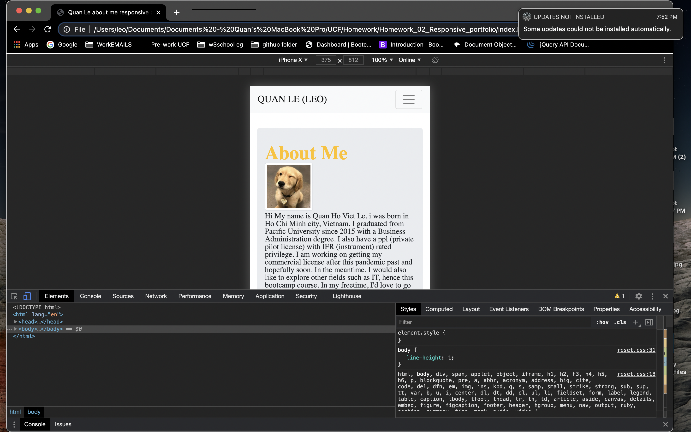
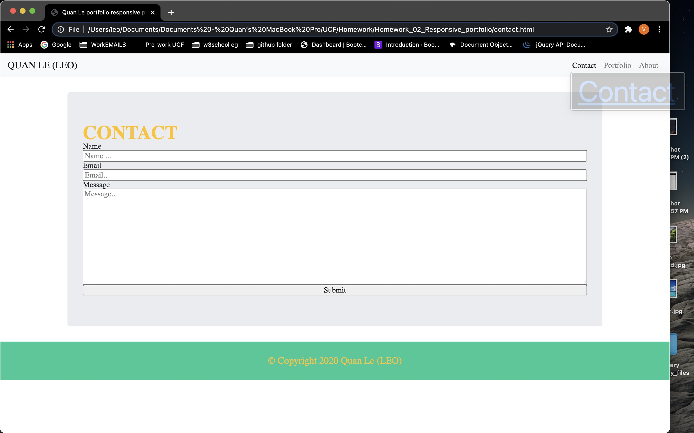
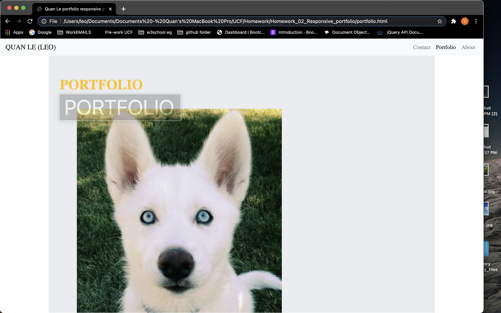

# Homework_02_Responsive-Portfolio-HW 

Overview I created a responsive portfolio which includes a group 3 files naming Contact, Portlio and Index all ends with. html

I Built them with HTML CSS Boostrap 4 
Screen sizes supported(according to Boostrap4/5) 
large - ≥992px 
medium - ≥768px 
small - ≥576px 
x-small - <576px 

DESCRIPTION: First I use Navbar function in Boostrap to create a collapsible and responsive NAVBAR.

For portfolio, I used jumbotron to have the content looks like the example pics and have the responsive factor enable by using collums and rows rules of boostrap.

For contact form, i used d-flex collumn from bootstrap and jumbotron to have the form responsive.

For index, I used jumbotron to have it looks like the example and media responsive.

I Also enabling media queries by allowing media to all.
Here are some pictures for my responsive portfolio

For the BONUS PART, i also created a sticky footer with copy rights with my name.

Thank you for reading and grading my HOMEWORK!
